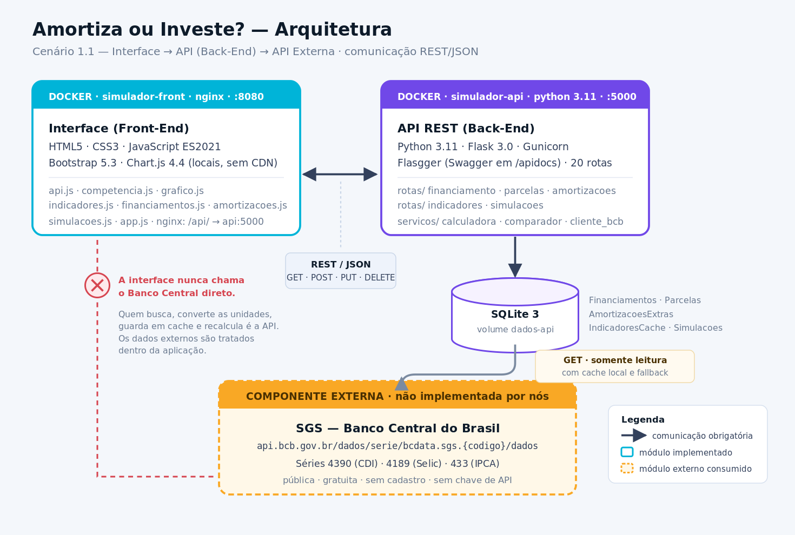

# Amortiza ou Investe? — Interface

Interface web de um simulador de financiamento imobiliário que responde a uma pergunta que a maioria das calculadoras de financiamento ignora:

> **Sobrou dinheiro. Vale mais a pena amortizar o financiamento ou investir esse valor?**

A resposta depende da taxa de mercado do dia, e por isso o sistema consome as séries do **Banco Central do Brasil** para calcular o custo de oportunidade de cada amortização — em vez de assumir uma taxa fixa chutada pelo usuário.

Este repositório contém a **componente principal (Interface)**. A API que a alimenta está em um repositório separado:
`https://github.com/SaraWolfP/software-architecture-mvp-api`

---

## O problema

Quem tem financiamento imobiliário e recebe um dinheiro extra — 13º, bônus, rescisão, venda de um bem — enfrenta uma decisão que parece óbvia e não é. Amortizar parece sempre certo, porque "juro de financiamento é caro". Mas:

- A amortização devolve valor **espalhado ao longo de anos**, em parcelas menores, enquanto o investimento devolve **um montante no resgate**. Comparar os dois exige colocá-los no mesmo instante do tempo.
- A soma das parcelas economizadas **embute o próprio aporte** — ela não é o juro economizado. Quem compara essa soma com o rendimento de um investimento está somando grandezas diferentes e sempre conclui que amortizar vence.
- O investimento paga **Imposto de Renda regressivo** no resgate, de 22,5% a 15% conforme o prazo. Ignorar isso superestima o lado "investir".

O sistema resolve os três problemas e apresenta o resultado como duas cifras diretamente comparáveis: **quanto dinheiro você tem no fim do contrato em cada estratégia**.

---

## Arquitetura

O sistema segue o **Cenário 1.1**: Interface → API (Back-End) → API Externa.



| Módulo | Papel | Repositório |
|---|---|---|
| **Interface** | Componente principal. Renderiza, valida e consome a API. | este repositório |
| **API REST** | Regras de negócio, persistência e integração externa. | [software-architecture-mvp-api](https://github.com/SaraWolfP/software-architecture-mvp-api) |
| **SGS / Banco Central** | Componente externa consumida. | `api.bcb.gov.br` |

### Por que a interface não fala com o Banco Central

Poderia — tecnicamente é uma chamada `fetch` a mais. Mas a API no meio resolve quatro coisas de uma vez:

1. **Tratamento na aplicação.** O BCB devolve `{"data": "01/09/2026", "valor": "0.41"}` — string, data invertida, percentual. A API converte para `{"data_referencia": "2026-09", "valor": 0.0041}`, normaliza a Selic de anual para mensal e só então entrega. O dado externo é consumido e transformado dentro do sistema, nunca repassado cru.
2. **Cache com fallback.** As séries vão para o SQLite. Se o BCB cair, a interface continua funcionando com o último valor conhecido, carimbado com a data — e exibe um selo avisando.
3. **Sem CORS.** Em produção o nginx faz proxy de `/api/`, então a interface usa caminhos relativos.
4. **Reprodutibilidade.** Cada simulação salva congela a taxa usada. Sem isso, um resultado guardado hoje mostraria números diferentes amanhã.

---

## A componente externa: SGS — Banco Central do Brasil

| Item | Detalhe |
|---|---|
| **Nome** | SGS — Sistema Gerenciador de Séries Temporais |
| **Provedor** | Banco Central do Brasil (autarquia federal) |
| **URL base** | `https://api.bcb.gov.br/dados/serie/bcdata.sgs.{codigo}/dados` |
| **Cadastro** | **Não é necessário** — sem conta, sem chave de API, sem token, sem OAuth |
| **Custo** | **Gratuito**, sem limite de requisições publicado |
| **Licença de uso** | Dados públicos de livre utilização, amparados pela [Lei de Acesso à Informação (Lei 12.527/2011)](https://www.planalto.gov.br/ccivil_03/_ato2011-2014/2011/lei/l12527.htm) e pela [Política de Dados Abertos do Poder Executivo Federal (Decreto 8.777/2016)](https://www.planalto.gov.br/ccivil_03/_ato2015-2018/2016/decreto/d8777.htm). O BCB solicita apenas a citação da fonte. |
| **Documentação** | https://dadosabertos.bcb.gov.br/ |
| **Formato** | JSON (`?formato=json`); datas em `dd/MM/yyyy`, valores como string decimal |

### Rotas externas utilizadas

| Série | Código | Endpoint chamado | Unidade devolvida | Uso no sistema |
|---|---|---|---|---|
| CDI acumulado no mês | **4390** | `/dados/serie/bcdata.sgs.4390/dados/ultimos/{n}?formato=json` | % ao mês | Taxa de rendimento do cenário "investir" |
| Selic acumulada no mês, anualizada | **4189** | `/dados/serie/bcdata.sgs.4189/dados/ultimos/{n}?formato=json` | % ao ano (base 252) | Taxa alternativa; referência comparada à taxa do contrato |
| IPCA — variação mensal | **433** | `/dados/serie/bcdata.sgs.433/dados/ultimos/{n}?formato=json` | % ao mês | Exibição informativa da inflação corrente |

### O tratamento aplicado aos dados externos

```
RESPOSTA CRUA DO BCB                    →  APÓS TRATAMENTO NA API
[{"data":"01/09/2026","valor":"0.41"}]     {"data_referencia": "2026-09",
                                            "valor": 0.0041,
                                            "taxa_mensal": 0.0041,
                                            "media_periodo": 0.0089,
                                            "origem": "bcb"}
```

1. `"01/09/2026"` → `"2026-09"` (ISO, competência mensal)
2. `"0.41"` (string, percentual) → `0.0041` (float, decimal)
3. **Normalização de unidade**: a Selic vem anualizada e é convertida por `(1 + i_aa)^(1/12) − 1`. Tratar o valor anual como mensal infla qualquer projeção em ordens de grandeza — é o erro mais comum ao usar o SGS.
4. Ordenação cronológica e cálculo da média do período
5. Gravação no cache com TTL, e uso dos valores na comparação amortizar-vs-investir

> **O consumo não gera redirecionamento.** O usuário nunca sai da aplicação nem vê a resposta do BCB. Os dados são buscados pelo servidor, convertidos, persistidos e recombinados com os dados locais antes de chegarem à tela.

---

## Funcionalidades

**Contratos**
- Cadastro, edição e exclusão de financiamentos nos sistemas **SAC** e **PRICE**
- Listagem com filtro por sistema, ordenação por cinco campos e paginação — tudo resolvido pela API via parâmetros de consulta
- Dica em tempo real comparando a taxa digitada com a Selic vigente

**Cronograma**
- Gráfico de todas as parcelas, com filtro por ano
- Interruptor para separar **juros e amortização** em barras empilhadas — deixa visível por que amortizar cedo economiza tanto
- Tooltip com o saldo devedor de cada competência
- Cards de resumo: total a pagar, parcelas restantes, juros totais e total já pago

**Amortizações extraordinárias**
- Lançamento, edição e remoção, com recálculo integral do cronograma a cada operação
- Dois efeitos: **reduzir o valor das parcelas** (mantém o prazo) ou **reduzir o prazo** (mantém o valor)

**Amortizar ou Investir?**
- Comparação com taxa real de mercado (CDI ou Selic), percentual do índice configurável (100%, 110%…) e IR regressivo
- Card de veredito, gráfico comparativo e detalhamento dos parâmetros
- Histórico de simulações salvas, com recálculo e exclusão
- Simulações são marcadas como **desatualizadas** quando o contrato muda

**Indicadores**
- Barra com CDI, Selic e IPCA correntes, cada um com *sparkline* de 12 meses
- Selo de procedência: dado lido agora do BCB ou servido do cache local
- Botão para forçar a releitura

---

## Tecnologias

- **HTML5**, **CSS3** e **JavaScript** (ES2021), sem framework
- [Bootstrap 5.3](https://getbootstrap.com/) — grid e componentes
- [Bootstrap Icons 1.11](https://icons.getbootstrap.com/)
- [Chart.js 4.4](https://www.chartjs.org/) — gráficos
- [nginx](https://nginx.org/) 1.27 — servidor estático e proxy reverso da API

As bibliotecas ficam em `vendor/`, **versionadas no repositório**, e são servidas pela própria aplicação. Nada é carregado de CDN em tempo de execução: um container que depende de CDN não é autocontido e a interface abre quebrada se a rede bloquear o domínio. O script `scripts/baixar-vendor.sh` existe apenas para atualizar as versões — não é necessário para rodar o projeto.

---

## Estrutura do projeto

```
software-architecture-mvp-front/
├── index.html                  # Página única da aplicação
├── Dockerfile                  # Build em dois estágios (vendor + nginx)
├── docker-compose.yml          # Sobe interface + API + banco
├── docker-compose.dev.yml      # Sobreposição para build local da API
├── nginx.conf                  # Servidor estático e proxy /api/ → api:5000
├── .dockerignore
├── css/
│   └── style.css               # Estilos da aplicação
├── js/
│   ├── api.js                  # Todas as chamadas à API (fetch centralizado)
│   ├── competencia.js          # Seletor de mês e ano das competências
│   ├── grafico.js              # Gráfico de parcelas (Chart.js)
│   ├── indicadores.js          # Barra de indicadores do Banco Central
│   ├── financiamentos.js       # Cadastro, listagem paginada e edição
│   ├── amortizacoes.js         # Amortizações extras e cards de resumo
│   ├── simulacoes.js           # Painel "Amortizar ou Investir?"
│   └── app.js                  # Inicialização e orquestração
├── scripts/
│   └── baixar-vendor.sh        # Baixa Bootstrap, Icons e Chart.js
├── vendor/                     # Bibliotecas locais (versionadas no repositório)
└── docs/
    ├── arquitetura.png         # Fluxograma da arquitetura
    ├── arquitetura.svg
    └── wireframes/             # Telas projetadas antes da implementação
```

Convenções adotadas: `kebab-case` para arquivos e classes CSS, `camelCase` para funções e variáveis JavaScript, `snake_case` nos campos JSON trocados com a API (que é Python).

---

## Como executar

### Opção 1 — Docker Compose (recomendado)

Sobe a interface, a API e o banco de uma vez. **Não precisa clonar o outro repositório nem ter Python instalado**: a imagem da API vem do Docker Hub.

**Pré-requisito:** [Docker](https://docs.docker.com/get-docker/) com **Docker Compose v2** — o comando é `docker compose` (com espaço), não `docker-compose`. Confirme com `docker compose version`.

```bash
git clone https://github.com/SaraWolfP/software-architecture-mvp-front.git
cd software-architecture-mvp-front

docker compose up
```

Aguarde a API ficar saudável (o `front` só sobe depois) e acesse:

| O quê | Endereço |
|---|---|
| **Interface** | http://localhost:8080 |
| Documentação da API (Swagger) | http://localhost:5001/apidocs |

Para encerrar: `Ctrl+C`, e `docker compose down` para remover os containers. Os dados ficam no volume `dados-api`; use `docker compose down -v` para apagá-los também.

#### Se alguma porta já estiver em uso

O Docker aborta com `bind: address already in use` e nada sobe. A porta `8080` é disputada com Jenkins, Tomcat e vários servidores de desenvolvimento. Basta trocar o **primeiro** número de cada par no `docker-compose.yml` — o segundo é a porta dentro do container e não deve mudar:

```yaml
  api:
    ports:
      - "5001:5000"    # troque 5001 se precisar
  front:
    ports:
      - "8081:80"      # era 8080
```

Depois acesse a interface na porta nova. Para descobrir o que está ocupando uma porta:

```bash
lsof -i :8080            # macOS e Linux
netstat -ano | find "8080"   # Windows
```

> A porta da API já é `5001` no host justamente porque o AirPlay Receiver do macOS ocupa a `5000` por padrão.

### Opção 2 — Docker, com a API construída localmente

Para trabalhar nos dois repositórios ao mesmo tempo, com ambos clonados lado a lado:

```bash
docker compose -f docker-compose.yml -f docker-compose.dev.yml up --build
```

> Construir **só** a imagem da interface e rodá-la isolada não funciona: o
> `nginx.conf` resolve `proxy_pass http://api:5000/` no momento em que carrega a
> configuração, e sem o container `api` na mesma rede o nginx nem inicia
> (`host not found in upstream`). Use sempre o Compose.

### Opção 3 — Ambiente local, sem Docker

**Pré-requisitos:** [Node.js](https://nodejs.org/) (ou Python 3) para servir os arquivos, e a API rodando em `http://127.0.0.1:5000`.

```bash
# 1. Clone o repositório
git clone https://github.com/SaraWolfP/software-architecture-mvp-front.git
cd software-architecture-mvp-front

# 2. Suba a API seguindo o README do repositório da API,
#    em outro terminal, na porta 5000

# 3. Sirva a interface
python3 -m http.server 3000      # ou: npx serve -l 3000
```

Acesse http://localhost:3000. Fora do nginx, `js/api.js` detecta o ambiente e aponta automaticamente para `http://127.0.0.1:5000`.

> **Não abra o `index.html` com duplo clique.** O protocolo `file://` bloqueia as requisições à API por política de origem.

---

## Roteiro de uso

1. **Cadastre um financiamento** — ex.: imóvel de R$ 500.000, entrada de R$ 100.000, 1,20% a.m., 360 meses, SAC. A dica abaixo do campo de taxa compara o valor digitado com a Selic do dia.
2. **Selecione-o na lista** para abrir o painel com cronograma e resumo.
3. **Ligue "Separar juros e amortização"** no gráfico e observe que, nos primeiros anos, quase toda a parcela é juro.
4. **Simule** — informe R$ 50.000 disponíveis, escolha CDI a 100% e compare as estratégias.
5. **Mude para 130% do CDI** e veja o veredito virar: existe um ponto de indiferença, e ele depende da taxa. (Com o CDI de agosto/2026, 1,09% a.m., a virada acontece para contratos entre ~1,05% e ~1,35% a.m.; abaixo disso, investir já vence a 100%.)
6. **Lance a amortização** de fato, e acompanhe o cronograma encolher.
7. **Edite o contrato** e note que as simulações salvas passam a ser sinalizadas como desatualizadas.

---

## Chamadas HTTP feitas pela interface

| Método | Rota | Onde, na interface |
|---|---|---|
| `GET` | `/financiamento/` | Lista lateral, com filtro, ordenação e paginação |
| `GET` | `/financiamento/<id>` | Cabeçalho do painel e modal de edição |
| `GET` | `/financiamento/<id>/parcelas` | Gráfico do cronograma |
| `GET` | `/financiamento/<id>/parcelas/resumo` | Card de juros totais |
| `GET` | `/financiamento/<id>/amortizacoes` | Tabela de amortizações |
| `GET` | `/financiamento/<id>/simulacoes` | Histórico de simulações |
| `GET` | `/indicadores/` | Barra de indicadores do topo |
| `POST` | `/financiamento/` | Formulário "Novo Financiamento" |
| `POST` | `/financiamento/<id>/amortizacoes` | Formulário "Nova Amortização" |
| `POST` | `/financiamento/<id>/simulacoes` | Botão "Comparar estratégias" |
| `POST` | `/indicadores/atualizar` | Botão de refresh da barra de indicadores |
| `PUT` | `/financiamento/<id>` | Modal "Editar Financiamento" |
| `PUT` | `/financiamento/<id>/amortizacoes/<id>` | Botão de lápis na tabela de amortizações |
| `PUT` | `/financiamento/<id>/simulacoes/<id>` | Botão de lápis no histórico de simulações |
| `DELETE` | `/financiamento/<id>` | Botão de lixeira na lista lateral |
| `DELETE` | `/financiamento/<id>/amortizacoes/<id>` | Botão de lixeira na tabela de amortizações |
| `DELETE` | `/financiamento/<id>/simulacoes/<id>` | Botão de lixeira no histórico |

---

## Como a comparação é calculada

As duas estratégias partem do mesmo ponto (R$ *A* disponíveis na competência do aporte) e chegam ao mesmo ponto (a última parcela do contrato original), o que as torna diretamente comparáveis.

**Amortizar** — gasta *A* abatendo o saldo. A cada mês seguinte sobra a diferença entre a parcela original e a nova, que é aplicada à taxa líquida até o fim do horizonte:

```
montante_amortizar = Σ (parcela_original − parcela_nova) × (1 + taxa_líquida)^(meses até o fim)
```

**Investir** — aplica *A* pelo horizonte inteiro, paga IR no resgate e segue pagando as parcelas originais:

```
montante_investir = A + [A × (1 + taxa × percentual)^n − A] × (1 − alíquota_IR)
```

A alíquota do IR sobre renda fixa é regressiva e definida por **dias corridos**: 22,5% até 180, 20% até 360, 17,5% até 720, 15% acima.

O veredito compara os dois montantes; diferenças abaixo de 1% do aporte são reportadas como empate técnico.

---

## Limitações conhecidas

- A projeção assume a taxa do indicador **constante** ao longo de todo o horizonte. O CDI de hoje não será o dos próximos 20 anos — o resultado é uma referência de decisão, não uma previsão.
- Não considera seguros obrigatórios (MIP/DFI), taxa de administração nem correção do saldo por TR, que existem em contratos reais do SFH.
- O IPCA é exibido como informação de contexto e não entra no veredito: deflacionar as duas estratégias pelo mesmo índice não altera qual delas vence.
- **Isto é um exercício acadêmico e não constitui recomendação de investimento.** Decisões financeiras reais merecem a orientação de um profissional habilitado.

---

## Repositórios do projeto

| Componente | Repositório |
|---|---|
| Interface (principal) | https://github.com/SaraWolfP/software-architecture-mvp-front |
| API REST (secundária) | https://github.com/SaraWolfP/software-architecture-mvp-api |
| API externa consumida | https://api.bcb.gov.br/dados/serie/bcdata.sgs.4390/dados?formato=json |

---

## Autoria

Desenvolvido por **Sara Wolf Peretti** como MVP da disciplina de Arquitetura de Software — Pós-graduação em Engenharia de Software, PUC-Rio.

Fonte dos dados econômicos: Banco Central do Brasil, Sistema Gerenciador de Séries Temporais (SGS).
